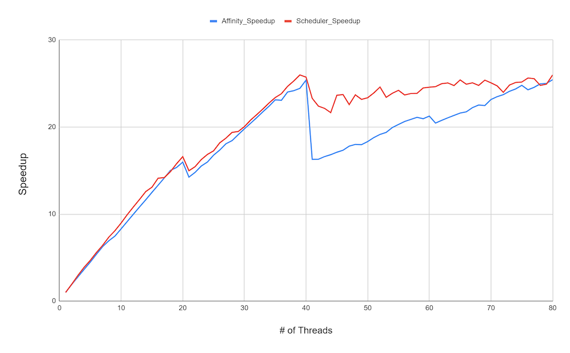
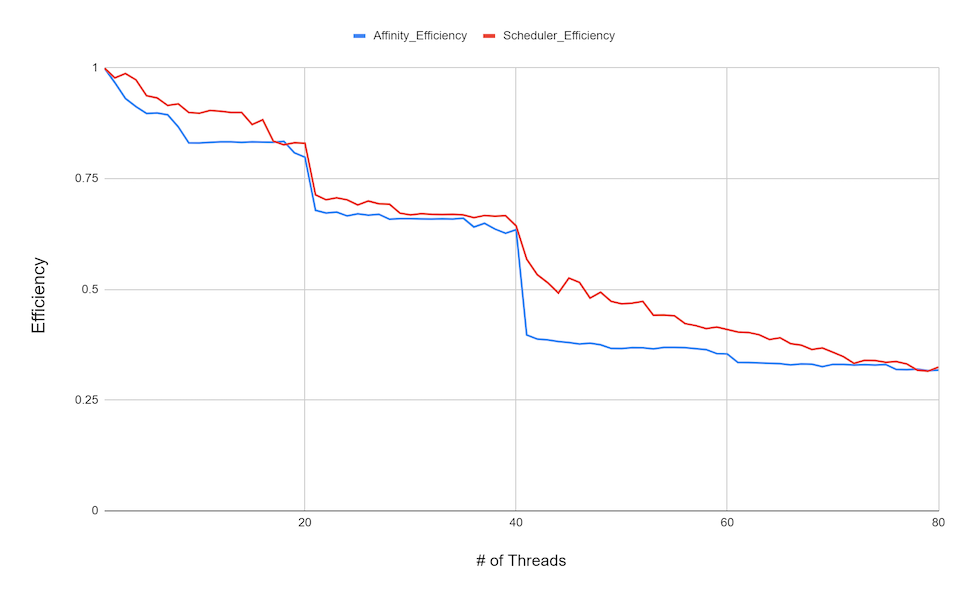

# Resources
* [Project description](http://www.cs.binghamton.edu/~kchiu/cs547/prog/1/)
* [Grading criteria](http://www.cs.binghamton.edu/~kchiu/cs547/index.html#programming_assignments)
* [Environment modules](https://modules.readthedocs.io/en/latest/) (general information)

## Notes
Announcements and notes from the class

### Testing on remote/openhpc
* Note that the remote cluster has 8 cores on each node, so should be fine for most of your development and testing.
* The `openhpc` cluster has hyperthreading on nodes 1-4, and disabled hyperthreading on 5-8. (Hyperthreading is also called SMT.)
    * So that means that c1-4 show 24 processors, but it's actually 12 cores and 2-way hyperthreading.
    * Your graph should show go up to 24 processors. Up to 12 should not use hyperthreading. (I.e., don't oversubscribe the cores.)

### Details on atomic instructions
They are basically implemented via a hardware-level locks: [link](https://stackoverflow.com/questions/14758088/how-are-atomic-operations-implemented-at-a-hardware-level). Conceptually, it is simply locking the bus, preventing other cores from accessing the bus until the atomic instruction has completed. So there is still a cost, but because the locking is lower-level, atomic instructions tend to be more performant than locking at the software level using a software lock (such as `pthread_mutex_lock()`). 

### Example plots
<table><tr><td></td><td></td></tr></table>
Brownie points for explaining the drop in speedup when going from 20 to 21 threads. Clearly it has something to do with hyperthreading, but the drop means that 21 threads actually took longer than 20 threads, which shouldn't happen with hardware threads.

Hint: Think about the most straightforward way to divide the work between threads, and the implications of that.

## Using the Remote Cluster at BU
* [Spedie Docs](https://spiediedocs.binghamton.edu/)
    * [Modules](https://spiediedocs.binghamton.edu/docs/spiedie_modules.html)
    * [Submitting jobs](https://spiediedocs.binghamton.edu/docs/submitting_jobs.html)
* [Slurm documentation](https://slurm.schedmd.com/documentation.html)

## Multithreading
* [POSIX Threads Programming](https://computing.llnl.gov/tutorials/pthreads/)
* [thread\_demo1.cpp](http://cs.binghamton.edu/~szaman5/thread_demo1.cpp) (from class)
* [Video](https://www.youtube.com/watch?v=OuzYICZUthM&list=PLLX-Q6B8xqZ8n8bwjGdzBJ25X2utwnoEG&index=7) on false sharing (Tim Mattson)

## Computing the Integral
* [Brief video segment](https://www.youtube.com/watch?v=FQ1k_YpyG_A&list=PLLX-Q6B8xqZ8n8bwjGdzBJ25X2utwnoEG&t=7m53s) on computing an example integral with sums (Tim Mattson)
    * [Slides 175-76](https://openmp.org/wp-content/uploads/Intro_To_OpenMP_Mattson.pdf#page=175) on Monte Carlo methods (calculating pi with darts)
* [Video](https://www.youtube.com/watch?v=WAf0rqwAvgg) on Monte Carlo integration
* [Integral Calculator](https://www.integral-calculator.com/)
    * Seems to have problems with negative bounds, unless `Integrate numerically only?` is checked
* [Reference](http://www.cplusplus.com/reference/random/uniform_real_distribution/) on `std::uniform_real_distribution` 
    * [Example use](http://www.cppstdlib.com/code/num/random1.cpp.html)
